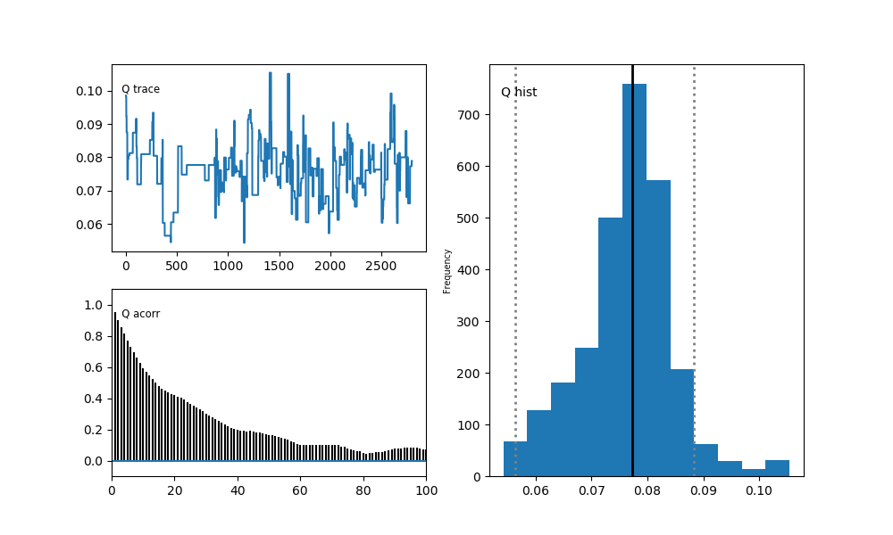

% Atmospheric Tomography User Manual
% Sangeeta Bhatia[^sb], Andew Feitz[^af] and Andrew Francis[^arf]

[^sb]: Centre for Research in Mathematics, Western Sydney University,
Sydney, Australia

[^af]: Geoscience Australia, Canberra, Australia 

[^arf]: Centre for Research in Mathematics, Western Sydney University,
Sydney, Australia

# License
This work is licensed under the Creative Commons Attribution 4.0 International License. To view a copy of this license, visit http://creativecommons.org/licenses/by/4.0/ or send a letter to Creative Commons, PO Box 1866, Mountain View, CA 94042, USA.

# About the software

The Atmospheric Tomography software is a command line tool written in python to estimate the emission rate of a point source from concentration data. It implements an extension of the Bayesian inversion method outlined in [this](http://www.sciencedirect.com/science/article/pii/S187661021300550X) paper. 

This manual walks a user through the steps needed to run the Atmospheric Tomography program. Please report any errors or omissions to the authors.

# Installation

Atmospheric Tomography code is available on [github](https://github.com/GeoscienceAustralia/atmospheric_tomography_laser). If you have git installed on your machine, the code can be checked out 
```
git clone https://github.com/GeoscienceAustralia/atmospheric_tomography_laser.git
```
The code can also be downloaded as a zip file from the link above. The code itself does not require any installation but you need to install Python to be able to run the code.

## Dependencies

1. Python (version 3 or later)
2. PyMC

Instructions for installing PyMC are available [here](https://pymc-devs.github.io/pymc/INSTALL.html). This page also has instructions for installing the correct version of Python. Using a prebuilt distribution such as [Anaconda](http://continuum.io/downloads) is highly recommended.

## Test the environment

If the installation is successful, you should be able to run Python and import the PyMC module. To test this, open the terminal utility on Mac OS X or Linux or the DOS prompt on Windows. The DOS prompt can be opened by clicking on the Windows (or Run) button on your machine and typing CMD.

On the command prompt type 
```
> python --version
```

If Python installation was successful, the command should run successfully and output the version of Python on your machine. 
```
> python --version
Python 2.7.10
>
```
If you get an error at this step, check if the PATH environment variable on your machine contains the path to python binaries. The Troubleshooting section of this manual contains more information on how to resolve this issue.

# Bayes’ theorem applied to quantification

Let ${\mathcal{P}}$ be a plume dispersion model. ${\mathcal{P}}(x, y, z, Q, \hdots)$ is the concentration of a pollutant at a point $(x,y,z)$ due to a source located at the origin and emitting at a rate of $Q$. The ellipsis denote the other parameters necessary to drive the dispersion model. The emission rate of the source, $Q$ is the parameter to be estimated. Let the measured concentration at $(x,y,z)$ be $C$. Then, from Bayes’ Theorem, we have

$$\label{equn:bayes_appl} P(Q \mid C) \propto P(C \mid Q)P(Q).$$

Suppose we have $N$ samples of the concentration data
$C_1, C_2, \hdots C_N$. Since each data point is independent, we have
$$P(C_1, C_2, \hdots C_N \mid Q) = P(C_1 \mid Q)P(C_2 \mid Q) \hdots P(C_N \mid Q).$$

Equation \[equn:bayes\_appl\] therefore becomes,
$$\label{equn:bayes_appl_comp} P(Q \mid C_1, C_2, \hdots C_N) \propto \prod_{i=1}^{N} P(C_i \mid Q) P(Q)$$

We assume that the observed concentrations are distributed according to
a Laplacian distribution [@laplace] centered at the predicted
concentration. That is, the probability of measuring concentration $C_i$
is
$$P(C_i) = \frac{1}{2 \tau_i} e^{-\left \vert C_i - P_i \right \vert/ \tau_i }.$$

With the simplifying assumption that the spread in the errors is the
same for all data points, we can rewrite equation  as, 
$$\begin{aligned}
P(Q \mid C_1, C_2, \hdots C_N) &\propto \prod_{i=1}^{N} \frac{1}{2 \tau} e^{-\left \vert C_i - P_i \right \vert/ \tau} P(Q) \\
& = \frac{1}{(2 \tau)^N} e^{{-\sum_{i=1}^N{(\left \vert C_i - P_i \right \vert)/ \tau}}} P(Q).\end{aligned}$$

The prior for the emission rate is set to a uniform probability
distribution on a small interval (0 to 1). The prior on the spread $\tau$ of residuals is set to an uninformative prior that returns a log-likelihood of zero irrespective of the arguments passed to it. 

## Changing the priors on $Q$ and $\tau$

These can be changed in the file *tomography.py*. Changing this file requires a knowledge of python. Many useful priors are made available by PyMC. PyMC documentation also contains helpful information on writing your own priors.

# Dispersion Models

## Gaussian dispersion model {#sec:gauss}

The plume dispersion model implemented is the Gaussian plume model [@sutton1932theory], which is one of the most popular
models used for atmospheric dispersion. The concentration $C(x,y,z)$ of
a pollutant at $(x, y, z)$ is given by the equation .
$$\label{equn:gauss_plume}
  C(x,y,z) = \frac{Q}{2 \pi U \sigma_y \sigma_z} exp(-\frac{y^2}{2\sigma_y^2})\left[ exp(-\frac{(z-H)^2}{2\sigma_z^2}) + exp(-\frac{(z+H)^2}{2\sigma_z^2})\right].$$
$C(x,y,z)$ is the concentration in grams per cubic meter. $H$ is the
height of the source, $Q$ is the rate of release in grams per second,
$U$ is the wind speed in meters per second. The parameters $\sigma_y$
and $\sigma_z$ are the standard deviations of the time averaged plume
concentration in downwind and vertical directions respectively.
$\sigma_y$ and $\sigma_z$ depend on the downwind distance $x$ and
atmospheric stability class. The most common form suggested for
$\sigma_y$ and $\sigma_z$ is a power law in the downwind distance $x$:

$$\begin{aligned}
\sigma_y &= a x^b \\
\sigma_z &= c x^d.
\end{aligned}$$ 

The coefficients $a, b, c$ and $d$ have also been determined by various
researchers for the atmospheric stability classes. In situations where
the assumptions made in determining the coefficients are met, these
coefficients may be used. We have used off-the-shelf values for these parameters. These parameters have been categorized according to
the Pasquill-Gifford atmospheric classification scheme while we use
the Monin-Obhukov length to determine the atmospheric stability class
and determine the coefficients to use. Table \[table:stab\_classes\]
shows the relation between the two classification schemes. The parameters can be changed as explained in Section.

  L                                                      Stability condition   PG stability class
  --------------------- -------------------------------- --------------------- --------------------
  Very large negative   $L < -10^5$ m                    Neutral               D
  Large negative        $-10^5$ m $\leq L \leq -100$ m   Unstable              B
  Small negative        $-100$ m $< L <0$                Very unstable         A
  Small positive        $0 < L <100$ m                   Very stable           F
  Large positive        $100$ m $\leq L \leq 10^5$ m     Stable                E
  Very large positive   $L > 10^5$ m                     Neutral               D

  : Monin-Obukhov Length L with respect to atmospheric stability
  [@seinfeld2012atmospheric][]{data-label="table:stab_classes"}

## Other Plume Dispersion Models

Two other plume dispersion models are implemented. The first of these, which we call the semi-gaussian model presented in @humphries2012atmospheric] has the the functional form:
$$\label{equn:semigaussian}
  C(x,y) = Q  \frac{A}{x^E} exp \left( -\frac{B}{x^F} \right) exp\left(-Cy^2\frac{(D + x^G)^2}{x^H}\right).$$

A simplified version is the following function 
$$\label{equn:gauss_poly}
  C(x,y) = Q (c_0 + c_1 x + c_2 x^2 + c_3 x^3)e^{-\frac{y^2}{A x^E}}.$$

This is called the gaussian-polynomial hybrid function. 

The parameters for these models for various values of the Monin-Obhukov length (i.e., different stability classes) were derived by fitting the concentrations from a Lagrangian stochastic (LS) model [@thomson1987criteria] as implemented
in WindTrax Version 2.0.8.8 [@windtrax]. 

# Modifying plume dispersion model parameters
The models implemented in the software are called ‘gaussian’,
‘semi-gaussian’ and ‘gauss\_poly’. The default model is the Gaussian model and its use is highly recommended. 

If you want to choose a different model, open the file *tomography.py* in a text editor and go to line 64.
```
reading_predicted[i] = util.line_average([source_x, source_y], 
                                          p0_list[reflector], 
                                          p1_list[reflector], 
                                          z_list[reflector], 
                                          samples, 1, h_source, 
                                          theta, T, P, params, 
                                          'gaussian')
```

Change the last parameter to one of the following values (in single quotes): semi-gaussian or gauss_poly. Do not copy the line above from this manual since python is space sensitive. Make sure that there are no spaces around the name and that the file is saved with the extension ".py".

The parameter values for the models for each stability class are stored in the file called *params.py*. To edit these parameters, open this file in a text editor and navigate to the section that has the same name as the method. For instance, the Gaussian plume dispersion model makes use of $4$ parameters called $a, b, c$ and $d$.  The relevant section in *params.py*
```
gaussian = {
'A': {'a':0.0383,'b':1.281,'c':0.495,'d':0.873},
'B': {'a':0.1393,'b':0.9467,'c':0.310,'d':0.897},
'D': {'a':0.0856,'b':0.8650,'c':0.122,'d':0.916},
'E': {'a':0.1094,'b':0.7657,'c':0.0934,'d':0.912},
'F': {'a':0.05645,'b':0.8050,'c':0.0625,'d':0.911}
}
```

You can change these values and save the file. Make sure the file is saved with the extension ".py" as text editors usually add the extension ".txt" when a file is saved.   

# From point measurements to line average

The Atmospheric Tomography software was developed to estimate the emission rate of a point source from the averaged measurements of concentrations along 
the laser beams extending from a transmitter unit to several reflectors placed around the source. The plume dispersion models discussed above predict the concentration at a point $(x,y,z)$. The predicted line sensor reading is therefore obtained by determining the concentration at several points along a line from the laser to the reflector, and computing the average or numerical line integral. The scripts will calculate the line averaged readings automatically.

# Preparing the data files 

The first step is to get the data in the format expected by the scripts.
The input file should be a comma separated file with the following
columns:

1.  Temperature in degree Celsius,

2.  Pressure in pascals,

3.  Wind speed in metres per second,

4.  Wind direction in degrees North of East,

5.  Monin-Obhukov length in metres,

6.  Reflector id (should be an integer) and

7.  Perturbation in PPM - this is the background subtracted concentration

The order of the columns cannot be changed. However the names of the columns do not impact the execution of the scripts. 

Often the data are stored in the wide rather than the long format that is required. That is, the weather data (temperature, pressure, wind speed and direction) are recorded separately and the concentration measurements are recorded as:
```
Date, Reflector_1, Reflector_2, Reflector_3...
```

The author of this software carried out the analysis in the statistical software R. Some suggestions for reformatting the concentration data and merging the weather and concentration records as well as calculating the background concentration have been included in the file *Pre-analysis.RMD*. This is R markdown file. You can open it with a text editor or with R Studio.

Another consideration is that the frequency at which the weather and concentration data are recorded could be different. For instance, the meteorological data might be collected every half an hour while the concentration data could be recorded several times in a minute. In this case, we found it useful to average the concentration records to the frequency of the weather records. A script has been provided to do this and instructions for using the script are provided in a later section.  

# Customizing model parameters 

The following model parameters are likely to remain unchanged across
multiple data sets, hence they are stored in the file constants.py. This file is in the directory atmospheric-tomography/src in the downloaded source code. It consists of the following key-value pairs:

1.  samples: The number of samples to be taken along the line from the laser to
    the mirror. The default value is 100. If the path is very long, you might want to increase this number to improve accuracy.$(x, y)$ Co-ordinates of the reflectors

2.  H: Height of the gas source $z_0$ in metres. Do not write the unit.

3.  molar_mass: Molar mass of the gas in grams per mole. Height of the reflectors $z$ in metres,

4. elevation: The height of each reflectors in meters. Notice that this is a comma-separated list in square brackets. You should enter the height of each reflector in this list, even if they are all same. So if the experiment has $n$ reflectors, this list would have $n$ numbers  

5. mirror: The $(x, y)$ co-ordinates of the laser source(s). This is a comma-separated list of $(x, y)$ co-ordinates where each set of co-ordinates is written within square brackets. The number of pairs in this list should be $n$ if you have $n$ reflectors.
 
6. reflectors : The $(x, y)$ co-ordinates of the reflectors. 

To change any of these values, open the file constants.py in a text editor such as notepad and edit the values. Make sure that the editor does not introduce any formatting in the file and that the file is saved with the extension ".py". 

All the dispersion models considered in section \[sec:fwd\_model\] place
the origin at the source and the horizontal axis along the plume
centerline.

# Atmospheric Tomography Scripts
  
Bring up the commandline (Terminal utility on Mac and Linux, DOS prompt on Windows) and navigate to the directory in which the source code has been downloaded. For instance, on my machine, since the source code is the path 
/home/atmospheric-tomography, I run the following commands in the directory 
/home/atmospheric-tomography.  
```
> pwd
> /home/atmospheric-tomography
```

The script to be executed is src/run-tomography.py. The argument to the script is a prefix for the output files (explained below). 
```
> python src/run-tomography.py gas-long
Enter the input file name : gas.csv 
Enter the number of iterations for the MCMC simulation: 3000
Enter the burn in for the MCMC simulation: 200
Enter the thining variable for the MCMC simulation: 1
[-------------    36%                  ] 1093 of 3000 complete in 0.5 sec
[-----------------69%------            ] 2083 of 3000 complete in 1.0 sec
[-----------------100%-----------------] 3000 of 3000 complete in 1.5 sec

```

As the above output shows, the script will ask the user for a number of inputs. The first input is the name of the file that contains the data.  The file can be placed anywhere on your filesystem. Enter the full path or a path relative to the current directory. For instance, if the input file, say gas.csv,  has been placed in /home/atmospheric-tomography/data, you can enter either 
```
Enter the input file name :/home/atmospheric-tomography/data/gas.csv
```
or
```
Enter the input file name : data/gas.csv
```

The script will now ask for the following inputs: the number of iterations for the MCMC simulation, burn in and the thinning variable. 

## Number of iterations, burn-in and thinning variable

### Number of iterations

A MCMC simulation proceeds by picking random values from the parameter space and evaluating the likelihood of the data for these values. The number of iterations is the number of times this process should be repeated. The trade-off here is between efficiency and accuracy - choosing a very high value (say 10 million) would cause the script to run for a much longer time  or even crash. We suggest that you use a moderately high value (say 30000) and inspect the output. If the output is not satisfactory, you can re-run the analysis. 

### Burn-in

Burn in is the number of initial samples that are discarded. There is a lot of academic discussion about the value to choose for this variable. For our purposes, it would be enough to choose a small value (say 1000) and inspect the output to make adjustments.

### Thinning Variable

Thinning is used to reduce the auto-correlation between the samples from MCMC. Thinning variable set to 2 instructs the software to discard alternate samples. The default is 1. If you set this to a higher number, consider increasing the number of iterations. Alternately, you can choose not to use thinning and run the simulation longer by increasing the iterations.

## Output from the script

At the end of the execution, three output files will be produced : summary.csv, tau.png and Q.png. These files names  will be prefixed with the argument given to the run-tomography script. So for this example, since we entered
```
> python src/run-tomography.py gas-long
```

the output files are:gas-long-summary.csv, gas-long-Q.png and gas-long-tau.png. The summary files contains the mean, credible intervals and the quantiles for the parameters Q and $tau$ of the model.

```
> cat gas-long-summary.csv
Parameter, Mean, SD, MC Error, Lower 95% HPD, Upper 95% HPD, 
q2.5, q25, q50, q75, q97.5
Q, 0.0761835622776, 0.0083433562919, 0.000679163092623, 
0.05641991631731031, 0.08835151368385437, 0.0602347048492, 
0.0720073345646, 0.0773136743722, 0.080788117267, 0.0927831965643
tau, 0.610945767146, 0.0309973605468, 0.00279190239341, 
0.5581020990278773, 0.6782829570190929, 0.54534570834, 
0.590228818219, 0.610630539386, 0.630884224234, 0.678282957019
```

The script will also produce two graphs - one for the posterior probability distribution of the source emission rate $Q$ and the other for the posterior probability of the width of the error $\tau$. Each group consists of three subplots. In the top left hand corner, you would see a graph of the trace of the MCMC run. This is a graph of the values sampled from the parameter space (in our case 0 to 1). The first few thousand runs would be evenly spread across the parameter space while towards the end the samples should be less widely spread. If this is not the case, you might want to re-run the simulation.

The plot in the bottom left corner is the auto-correlation plot. The initial part of the graph may display a high degree of auto correlation but it should reduce as the MCMC simulation progressed. If you see high auto correlation values throughout the simulation, consider running the simulation with more iterations and/or thinning variable set to more than 1.

The plot on the right side is the posterior probability distribution. The 95% credible interval is marked by dashed lines.



## More information

There are a number of online resources discussion Bayesian statistics. For PyMC, [this](https://www.youtube.com/watch?v=XbxIo7ScVzc) video can be a useful starting point. It also covers the basics of Bayesian statistics. 

# Other Utilities : Average over a fixed time interval

The first step is to average the raw data over a fixed time interval for
each reflector. This needs to be done because while the
concentration data is collected every couple of seconds, the weather data might be collected at a much lower frequency. This can easily be done in R. A python script called *average\_over.py* is also available in this repository in the folder util to do this. The arguments to this script are summarised below.

Options
-------
1. -infile or -in. Input file. The script should either be run from the
same directory (folder) in which the input file is present, or the file should be specified with the full path relative to the location of the script.

2. -timestamp or -ts Header (case sensitive) of the column containing time.
-format the format in which the time is written in the file. E.g. if the entry is 00:00:05, the format should be %H:%M:%S. More information below.

3. -over or -o  Average over this interval specified in hours:minues:seconds. E.g. if you want to average over every one minute, give 00:01:00. Both the end points are included when average is computed.

4. -cols -c  If you want to average only specific columns, then you can specify the column names in this option. This field is optional.

5. -exclude  These are the fields which cannot or should not be included in the output. This field is optional but it is important to specify any columns containing non-numeric data to this field. You can specify any number of columns to be excluded as a space separated list.

6. -outfile or -out. the output file. Note that it should be different from the name of the input file. If unspecified, the output will be written to the file <infile>_out.csv in the same folder in which the input file is present.

For the following input file (from Boreal Laser GasFinder2), suppose we wish to average over 10 minutes the column PPM.

```
> head infile
Header,Reflector,PPMM,PPM,R2,Distance,Light,Date,Hour,Serial,Check
$GFDTA,7,85.4,1.483,98,57.57,4852,11/05/2015,8:22:17 AM, CH4OP-1044,1*55
$GFDTA,7,85.5,1.485,98,57.57,4842,11/05/2015,8:22:19 AM, CH4OP-1044,1*5B
$GFDTA,1,65.1,1.600,98,40.7,3770,11/05/2015,8:22:35 AM, CH4OP-1044,1*5C
$GFDTA,1,65.1,1.600,98,40.7,3698,11/05/2015,8:22:36 AM, CH4OP-1044,1*58
```

The script would be executed as

```
> python average_over.py -in infile -ts Hour -format %I:%M:%S %p -o
00:10:00 -cols PPM -exclude Header Reflector Serial Check Date -out tmp
> head tmp
Hour,PPMM
08:22:17 AM,80.47239263803684
08:32:23 AM,82.25091743119266
08:43:03 AM,80.66826923076927
```

You can construct the format for the timestamp by looking at the
directives [here](https://docs.python.org/3/library/datetime.html#strftime-strptimebehavior)


# Troubleshooting

1. Cannot install python or PyMC.
   Make sure you have administrator privileges on your machine. 

2. Script cannot find module PyMC.
   Python finds the installed modules by referring to an environment variable called pythonpath. If you have installed the PyMC module correctly, you would find it in a directory called site-packages. Locate this directory in your filesystem and copy its path. On Mac/Linux, add the following line to the file .bash_profile. This file is located in your home directory.

   ```
   export PYTHONPATH=$PYTHONPATH:/home/anaconda/lib/python3.6/site-packages/
   ```
   
   Replace the path after the colon with the location of the site-packages directory on your filesystem. 
   The instructions for modifying environment variables on a Windows machine are available [here](https://superuser.com/questions/949560/how-do-i-set-system-environment-variables-in-windows-10).

3. Cannot find python.
   The operating system finds the python executables using the PATH environment variable. Locate the bin folder that contains the python executables and modify the PATH variable to include it by editing the bash_profile on Mac/Linux. 
   ```
   PATH="/Library/Frameworks/Python.framework/Versions/3.4/bin:${PATH}"
   export PATH
   ```

4. The results look all wrong.
   While there are many reasons this can happen, do check that the units of all parameters are correct i.e., pressure is in pascals, temperature is degree Celsius etc. Note that the units are not to be specified in the input file. Make sure the background subtracted concentration is in PPM.

# Citing this work

You can use the following bibtex entry for citing this work.
```
@misc{feitz2017,
  author = {Bhatia Sangeeta, Feitz Andrew and Francis Andrew},
  title = {Atmospheric Tomography},
  year = {2017},
  publisher = {GitHub},
  journal = {GitHub repository},
  howpublished = {\url{https://github.com/GeoscienceAustralia/
	atmospheric_tomography_laser}}
}
```
Alternately, you can cite it as:
```
Bhatia Sangeeta, Feitz Andew and Francis Andrew, Atmospheric
Tomography, (2017), GitHub repository, 
https://github.com/GeoscienceAustralia/atmospheric_tomography_laser
```
\newpage

# References
